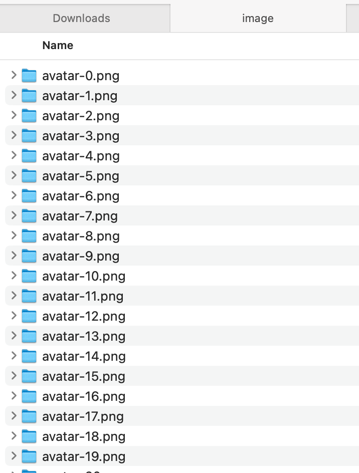

# s3-migration-task
S3 migration task from one bucket to another

## Assumptions: 
- All images in legacy bucket are all under image/ path
- All images in production bucket are all under avatar/ path
- Legacy and production buckets are in the same AWS account and the same AWS region
- KMS encryption is not specified, this assumes that no KMS encryption is applied
- Other S3 features not specified, this assumes that storage type is Standard and files are small in size and does not require multipart uploads

## Steps taken:

### 1. Create git repository and clone
git clone https://github.com/fayetumaliuan/s3-migration-task.git

### 2. Minio setup

Installed Minio

> brew install minio/stable/minio

> export MINIO_CONFIG_ENV_FILE=/etc/default/minio

> minio server '/Users/fayebeatriz/Documents/Faye Docs/Resume/Sketch' --console-address :9090

### 3. Postgres setup and S3 priveleges

Installed postgres: https://postgresapp.com

> Run schema.sql

> CREATE ROLE migrateuserrw WITH
>   LOGIN
>   NOSUPERUSER
>   INHERIT
>   NOCREATEDB
>   NOCREATEROLE
>   NOREPLICATION
>   ENCRYPTED PASSWORD 'XXXX';

> GRANT CONNECT ON DATABASE proddatabase TO migrateuserrw;

> GRANT SELECT, INSERT, UPDATE ON avatars TO migrateuserrw;

> GRANT USAGE, SELECT ON SEQUENCE avatars_id_seq TO migrateuserrw;

For the S3 priveleges, IAM role permission:

> {
>     "Version": "2012-10-17",
>     "Statement": [
>         {
>             "Sid": "AllowAuroraToExampleBucket",
>             "Effect": "Allow",
>             "Action": [
>                 "s3:GetObject",
>                 "s3:GetObjectVersion",
>                 "s3:ListBucket",
>                 "s3:PutObject",
>                 "s3:DeleteObject"
>             ],
>             "Resource": [
>                 "arn:aws:s3:::legacy-s3",
>                 "arn:aws:s3:::legacy-s3/*",
>                 "arn:aws:s3:::production-s3",
>                 "arn:aws:s3:::production-s3/*"
>             ]
>         }
>     ]
> }

### 4. Seeder file setup

> Run seeder.py 

---------------------------------------------------------------
After this step, the environment and configuration is complete.

### 5. Test migration tool

This python script lists all objects in a legacy bucket, copies object to the new bucket, updates the database for the new path, and deletes the object from the old path using parallel execution. 

Before running the migration tool (all images under the legacy bucket under image folder):

After running the migration tool (all images under the production bucket under avatar folder):

The database is updated to the new path locations as well:

> In case the job fails in any of these steps, the python file can be ran again since the old path/object is only deleted once this whole process is completed. If the job fails, all the remaining objects in the old path can be re-ran until all objects are moved and deleted from the old path. 

How to run migration-tool.py

a. Install needed python modules:

> sys, os, logging, argparse, psycopg2,  boto3, pandas, re, time, concurrent.futures, csv

b. Change applicable variables in lines 82-89 if needed

c. Run python file with parameters, the following arguments are required: db_user (Postgres User), db_pw (Postgres Password), aws_key (AWS key), aws_secret (AWS secret)

### 6. Deployment plan

High level deployment plan:

Testing environment:
- Run the tool on a development/testing environment to test code performance

Deployment:
- Take a backup of the *avatars* table
- Run pre-deployment checks 
- Run migration-tool.py
- Validation step

### 7. Performance and Scalability

Due to the testing environment constraints, this tool cannot be tested fully without hundreds of millions of data. For this task, I tested created a single thread version and then created another version of the tool which implements concurrent threads.

For 2000 files:

(w/o concurrent threads):
> Execution time: 21.103289127349854 seconds 

(w/ concurrent threads):
> Execution time: 13.67851185798645 seconds 

Adding a concurrency feature improved the execution time. 

Another method comes to mind, which is using **S3 Batch Operations**. The method is not available for use with the current minio setup, but the high level implementation would look like the below steps:

- Use S3 Batch Operations using boto3 to create a task to copy images from the legacy bucket to another (or this can be done through the console as well since this is a one-time operation)
- Wait for the task to complete 
- Take a backup of the *avatars* table
- Once all images have been copied, update the *avatars* table in the database using regex (again, assuming that all paths in the production bucket has the same folder structure)
- Validation step
- Delete all images under legacy bucket using the same S3 batch method

This method makes sure that the S3 copy step is done through batch loading and that the Production PostgreSQL database is also done more efficiently compared to the row per row method. 

